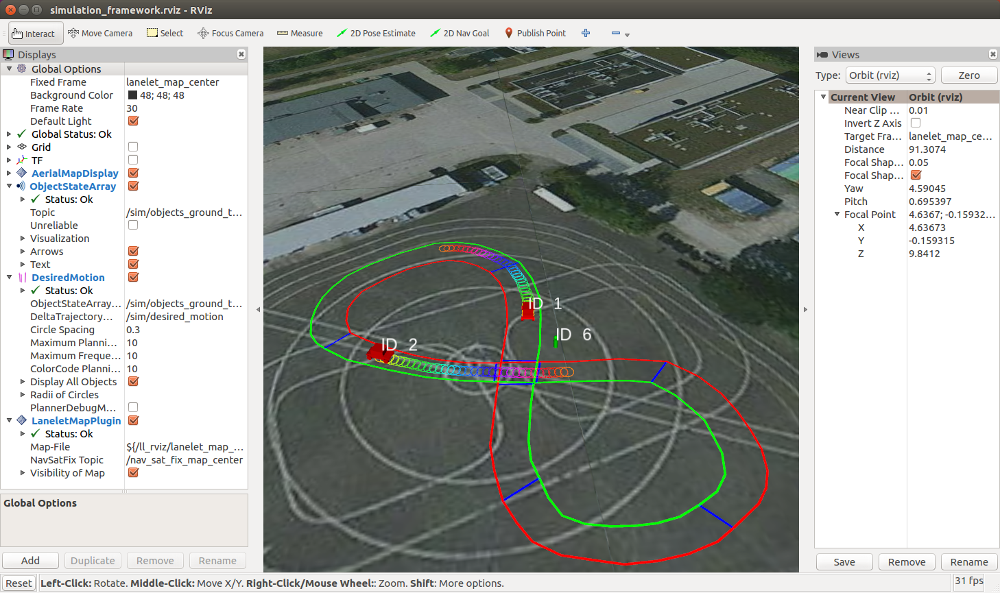

# CoInCar-Sim
### An Open-Source Simulation Framework for Cooperatively Interacting Automobiles

This is the main readme of the ROS Simulation Framework CoInCar-Sim, developed jointly within the [Priority Program 1835 "Cooperatively Interacting Automobiles"](http://www.coincar.de/) of the German Science Foundation (DFG) and within the [TechCenter A-Drive](http://tcadrive.de/) funded by the state of Baden-Württemberg.

The motivation and concept is explained in

Maximilian Naumann, Fabian Poggenhans, Martin Lauer, Christoph Stiller. **CoInCar-Sim: An Open-Source Simulation Framework for Cooperatively Interacting Automobiles.** In _Proc. IEEE Int. Conf. Intelligent Vehicles_, June 2018. to appear. [[.pdf]](http://www.mrt.kit.edu/z/publ/download/2018/Naumann2018CoInCarSim.pdf)

## General Information
Installation requires Linux as operating system. The framework is developed and tested under [Ubuntu 16.04](http://releases.ubuntu.com/16.04/).

#### Prerequisites
In order to use the framework, you need to install the following packages (installable via `apt install`)
* ROS (see http://wiki.ros.org/ROS/Installation)
  * `ros-kinetic-desktop-full`
  * `ros-kinetic-geodesy`
  * `ros-kinetic-tf2-geometry-msgs`
* Catkin tools and wstool
  * `python-catkin-tools` (http://catkin-tools.readthedocs.io/en/latest/index.html)
  * `python-wstool` (http://wiki.ros.org/wstool)
* System Libraries
  * `libpugixml-dev`
  * `qt5-default`
  * boost and eigen are installed with ROS

#### Required repositories

External Dependencies
* [automated_driving_msgs](https://github.com/fzi-forschungszentrum-informatik/automated_driving_msgs): messages used by the framework
* [mrt_cmake_modules](https://github.com/KIT-MRT/mrt_cmake_modules): cmake helper
* [rosinterface_handler](https://github.com/KIT-MRT/rosinterface_handler): ROS interface handling
* [rviz_satellite](https://github.com/gareth-cross/rviz_satellite): plugin for visualization of satellite images

Parts of this Framework

* general functionality:
  * simulation_initialization_ros_tool: settings and launchfiles
  * simulation_management_ros_tool: core functionality (localization, time and initialization management)

* sample vehicle:
  * sim_sample_perception_ros_tool
  * sim_sample_prediction_ros_tool
  * sim_sample_planning_ros_tool
  * sim_sample_actuator_ros_tool
  * sim_sample_communication_ros_tool

* visualization:
  * desired_motion_rviz_plugin_ros
  * lanelet_rviz_plugin_ros
  * motion_state_rviz_plugin_ros
  * object_state_array_rviz_plugin_ros

* utilities:
  * simulation_only_msgs: additional messages
  * simulation_utils_ros_tool: small utility nodes
  * sim_lanelet: lanelet map library
  * util_automated_driving_msgs
  * util_eigen_geometry
  * util_geo_coordinates_ros
  * util_geometry_msgs
  * util_lanelet
  * util_rviz
  * util_simulation_only_msgs

* see the readme of the respective package for details

## Installation
This section describes the installation of the framework, assuming the prerequisites have already been installed.

For the full installation starting at a clean Ubuntu 16.04, have a look at how Travis does it in about 10 minutes: 

#### 1) Source ROS
* open a terminal
* source ROS
  * `source /opt/ros/kinetic/setup.bash`
  * you might want to add this to your `.bashrc`

#### 2) Download the workspace config
* download the desired `*.rosinstall` file from the folder `ws_config` (or clone this repo)
  * recommended: use `simulation_framework_latest.rosinstall`

#### 3a) Set up and build the workspace yourself
* set up a catkin workspace from the `*.rosinstall` file you just downloaded
  * ` $ mkdir catkin_ws && cd catkin_ws`
  * `catkin_ws$ wstool init src PATH_TO_ROSINSTALL_FILE.rosinstall`
* build the workspace
  * `catkin_ws$ catkin build`
* source the build-files
  * `catkin_ws$ source devel/setup.bash`

or
#### 3b) Use the script
* also download the script and do the above steps by starting
  * ` $ ./setup_workspace.sh simulation_framework_latest.rosinstall`

## Usage
#### 4) Launch the framework
* source the build-files
  * `catkin_ws$ source devel/setup.bash`
* start the simulation framework by launching the main launchfile:
  * `catkin_ws$ roslaunch simulation_initialization_ros_tool _whole_framework.launch`
  * see the Readme of simulation_initialization_ros_tool for details about how the parts of the framework are launched

#### 5) Play with it
* as further described in [FIRST_STEPS.md](FIRST_STEPS.md)

#### 6) Contribute
* fork simulation_initialization_ros_tool and modify the launchfiles/settings/workspace config to simulate (parts of) your vehicle
* fork other components or create new vehicles to modify and/or extend the functionality

#### 7) Stay tuned
* if you did choose the latest version, you can update it with
  * `catkin_ws$ wstool update`

## License
See the respective packages for license issues.
